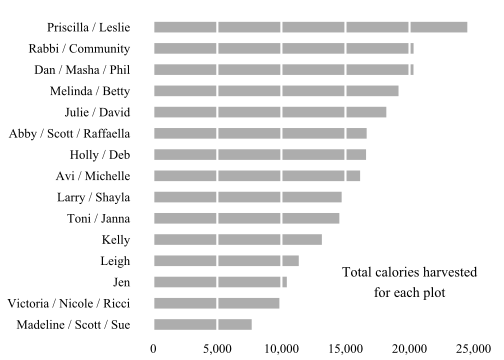

## 2015 overall results

We had great results again in 2015! 

We are on track for the biggest harvest ever in 2015, even more than [2014 which was the previous highest yields ever](http://sgaul.github.io/peah2014/).    

While we are still harvesting, gardeners so far have distributed 2,500 pounds of vegetables or about 230,000 calories - roughly three months of food for an adult. This is on track with last year's totals, which were the previous highest ever.

Here is the same result in pounds harvested. 

## 2015 individual results

We distributed 27 different kinds of vegetables this year - more than most years - with tomatoes, squash and zucchini yielding the most (over 300 lbs of each). 

 

The results by calories are similar, with a couple of high-calorie crops like beets and kale having more of an impact: 

 

The results by plot are here - congratulations to Priscilla, Leslie, Dan, Masha and Phil and everyone the worked on the Community plot!

 

Individual results for the year are listed in the table below. 

<!-- html table generated in R 3.2.1 by xtable 1.7-4 package -->
<!-- Sun Sep 27 12:01:45 2015 -->
<table border=1>
<tr> <th> Name </th> <th> Crop </th> <th> Pounds </th> <th> Calories </th>  </tr>
  <tr> <td> Abby / Scott / Raffaella </td> <td> arugula </td> <td align="right"> 1 </td> <td align="right"> 114 </td> </tr>
  <tr> <td> Abby / Scott / Raffaella </td> <td> cabbage </td> <td align="right"> 104 </td> <td align="right"> 11804 </td> </tr>
  <tr> <td> Abby / Scott / Raffaella </td> <td> peas </td> <td align="right"> 0 </td> <td align="right"> 84 </td> </tr>
  <tr> <td> Abby / Scott / Raffaella </td> <td> peppers </td> <td align="right"> 30 </td> <td align="right"> 2747 </td> </tr>
  <tr> <td> Abby / Scott / Raffaella </td> <td> tomatoes </td> <td align="right"> 28 </td> <td align="right"> 1907 </td> </tr>
  <tr> <td> Avi / Michelle </td> <td> collards </td> <td align="right"> 7 </td> <td align="right"> 953 </td> </tr>
  <tr> <td> Avi / Michelle </td> <td> cucumbers </td> <td align="right"> 54 </td> <td align="right"> 3660 </td> </tr>
  <tr> <td> Avi / Michelle </td> <td> escarole </td> <td align="right"> 10 </td> <td align="right"> 753 </td> </tr>
  <tr> <td> Avi / Michelle </td> <td> herbs </td> <td align="right"> 8 </td> <td align="right"> 1308 </td> </tr>
  <tr> <td> Avi / Michelle </td> <td> kohlrabi </td> <td align="right"> 1 </td> <td align="right"> 123 </td> </tr>
  <tr> <td> Avi / Michelle </td> <td> lettuce </td> <td align="right"> 24 </td> <td align="right"> 1668 </td> </tr>
  <tr> <td> Avi / Michelle </td> <td> parsley </td> <td align="right"> 2 </td> <td align="right"> 409 </td> </tr>
  <tr> <td> Avi / Michelle </td> <td> tomatoes </td> <td align="right"> 107 </td> <td align="right"> 7270 </td> </tr>
  <tr> <td> Dan / Masha / Phil </td> <td> peas </td> <td align="right"> 6 </td> <td align="right"> 1932 </td> </tr>
  <tr> <td> Dan / Masha / Phil </td> <td> squash </td> <td align="right"> 253 </td> <td align="right"> 18378 </td> </tr>
  <tr> <td> Holly / Deb </td> <td> broccoli </td> <td align="right"> 25 </td> <td align="right"> 3859 </td> </tr>
  <tr> <td> Holly / Deb </td> <td> cabbage </td> <td align="right"> 8 </td> <td align="right"> 908 </td> </tr>
  <tr> <td> Holly / Deb </td> <td> kale </td> <td align="right"> 4 </td> <td align="right"> 1022 </td> </tr>
  <tr> <td> Holly / Deb </td> <td> tomatoes </td> <td align="right"> 115 </td> <td align="right"> 7832 </td> </tr>
  <tr> <td> Holly / Deb </td> <td> turnips </td> <td align="right"> 24 </td> <td align="right"> 2987 </td> </tr>
  <tr> <td> Jen </td> <td> arugula </td> <td align="right"> 2 </td> <td align="right"> 227 </td> </tr>
  <tr> <td> Jen </td> <td> cabbage </td> <td align="right"> 28 </td> <td align="right"> 3235 </td> </tr>
  <tr> <td> Jen </td> <td> herbs </td> <td align="right"> 1 </td> <td align="right"> 163 </td> </tr>
  <tr> <td> Jen </td> <td> lettuce </td> <td align="right"> 54 </td> <td align="right"> 3711 </td> </tr>
  <tr> <td> Jen </td> <td> squash </td> <td align="right"> 42 </td> <td align="right"> 3087 </td> </tr>
  <tr> <td> Julie / David </td> <td> lettuce </td> <td align="right"> 32 </td> <td align="right"> 2213 </td> </tr>
  <tr> <td> Julie / David </td> <td> peas </td> <td align="right"> 4 </td> <td align="right"> 1512 </td> </tr>
  <tr> <td> Julie / David </td> <td> tomatoes </td> <td align="right"> 190 </td> <td align="right"> 12939 </td> </tr>
  <tr> <td> Julie / David </td> <td> zucchini </td> <td align="right"> 21 </td> <td align="right"> 1525 </td> </tr>
  <tr> <td> Kelly </td> <td> beans </td> <td align="right"> 5 </td> <td align="right"> 704 </td> </tr>
  <tr> <td> Kelly </td> <td> cabbage </td> <td align="right"> 9 </td> <td align="right"> 1022 </td> </tr>
  <tr> <td> Kelly </td> <td> cucumbers </td> <td align="right"> 23 </td> <td align="right"> 1566 </td> </tr>
  <tr> <td> Kelly </td> <td> lettuce </td> <td align="right"> 20 </td> <td align="right"> 1369 </td> </tr>
  <tr> <td> Kelly </td> <td> peppers </td> <td align="right"> 6 </td> <td align="right"> 568 </td> </tr>
  <tr> <td> Kelly </td> <td> spinach </td> <td align="right"> 5 </td> <td align="right"> 522 </td> </tr>
  <tr> <td> Kelly </td> <td> squash </td> <td align="right"> 36 </td> <td align="right"> 2579 </td> </tr>
  <tr> <td> Kelly </td> <td> tomatoes </td> <td align="right"> 40 </td> <td align="right"> 2724 </td> </tr>
  <tr> <td> Kelly </td> <td> zucchini </td> <td align="right"> 29 </td> <td align="right"> 2107 </td> </tr>
  <tr> <td> Larry / Shayla </td> <td> collards </td> <td align="right"> 100 </td> <td align="right"> 13586 </td> </tr>
  <tr> <td> Larry / Shayla </td> <td> peppers </td> <td align="right"> 8 </td> <td align="right"> 681 </td> </tr>
  <tr> <td> Larry / Shayla </td> <td> squash </td> <td align="right"> 6 </td> <td align="right"> 436 </td> </tr>
  <tr> <td> Leigh </td> <td> beans </td> <td align="right"> 2 </td> <td align="right"> 211 </td> </tr>
  <tr> <td> Leigh </td> <td> broccoli </td> <td align="right"> 20 </td> <td align="right"> 3126 </td> </tr>
  <tr> <td> Leigh </td> <td> cauliflower </td> <td align="right"> 32 </td> <td align="right"> 3632 </td> </tr>
  <tr> <td> Leigh </td> <td> cucumbers </td> <td align="right"> 22 </td> <td align="right"> 1498 </td> </tr>
  <tr> <td> Leigh </td> <td> kale </td> <td align="right"> 1 </td> <td align="right"> 284 </td> </tr>
  <tr> <td> Leigh </td> <td> swiss chard </td> <td align="right"> 7 </td> <td align="right"> 625 </td> </tr>
  <tr> <td> Leigh </td> <td> zucchini </td> <td align="right"> 27 </td> <td align="right"> 1979 </td> </tr>
  <tr> <td> Madeline / Scott / Sue </td> <td> beans </td> <td align="right"> 21 </td> <td align="right"> 2956 </td> </tr>
  <tr> <td> Madeline / Scott / Sue </td> <td> mustard greens </td> <td align="right"> 3 </td> <td align="right"> 368 </td> </tr>
  <tr> <td> Madeline / Scott / Sue </td> <td> tomatoes </td> <td align="right"> 64 </td> <td align="right"> 4358 </td> </tr>
  <tr> <td> Melinda / Betty </td> <td> broccoli </td> <td align="right"> 8 </td> <td align="right"> 1312 </td> </tr>
  <tr> <td> Melinda / Betty </td> <td> collards </td> <td align="right"> 11 </td> <td align="right"> 1464 </td> </tr>
  <tr> <td> Melinda / Betty </td> <td> corn </td> <td align="right"> 7 </td> <td align="right"> 3114 </td> </tr>
  <tr> <td> Melinda / Betty </td> <td> eggplant </td> <td align="right"> 8 </td> <td align="right"> 872 </td> </tr>
  <tr> <td> Melinda / Betty </td> <td> escarole </td> <td align="right"> 38 </td> <td align="right"> 2894 </td> </tr>
  <tr> <td> Melinda / Betty </td> <td> kale </td> <td align="right"> 36 </td> <td align="right"> 8229 </td> </tr>
  <tr> <td> Melinda / Betty </td> <td> kohlrabi </td> <td align="right"> 10 </td> <td align="right"> 1256 </td> </tr>
  <tr> <td> Priscilla / Leslie </td> <td> beets </td> <td align="right"> 60 </td> <td align="right"> 11762 </td> </tr>
  <tr> <td> Priscilla / Leslie </td> <td> parsley </td> <td align="right"> 0 </td> <td align="right"> 41 </td> </tr>
  <tr> <td> Priscilla / Leslie </td> <td> swiss chard </td> <td align="right"> 134 </td> <td align="right"> 11516 </td> </tr>
  <tr> <td> Priscilla / Leslie </td> <td> tomatoes </td> <td align="right"> 18 </td> <td align="right"> 1192 </td> </tr>
  <tr> <td> Rabbi / Community </td> <td> basil </td> <td align="right"> 1 </td> <td align="right"> 104 </td> </tr>
  <tr> <td> Rabbi / Community </td> <td> corn </td> <td align="right"> 20 </td> <td align="right"> 8898 </td> </tr>
  <tr> <td> Rabbi / Community </td> <td> herbs </td> <td align="right"> 1 </td> <td align="right"> 163 </td> </tr>
  <tr> <td> Rabbi / Community </td> <td> kohlrabi </td> <td align="right"> 9 </td> <td align="right"> 1103 </td> </tr>
  <tr> <td> Rabbi / Community </td> <td> mustard greens </td> <td align="right"> 4 </td> <td align="right"> 490 </td> </tr>
  <tr> <td> Rabbi / Community </td> <td> parsley </td> <td align="right"> 1 </td> <td align="right"> 163 </td> </tr>
  <tr> <td> Rabbi / Community </td> <td> squash </td> <td align="right"> 84 </td> <td align="right"> 6065 </td> </tr>
  <tr> <td> Rabbi / Community </td> <td> tomatoes </td> <td align="right"> 27 </td> <td align="right"> 1839 </td> </tr>
  <tr> <td> Rabbi / Community </td> <td> zucchini </td> <td align="right"> 20 </td> <td align="right"> 1489 </td> </tr>
  <tr> <td> Toni / Janna </td> <td> cucumbers </td> <td align="right"> 17 </td> <td align="right"> 1158 </td> </tr>
  <tr> <td> Toni / Janna </td> <td> radishes </td> <td align="right"> 4 </td> <td align="right"> 327 </td> </tr>
  <tr> <td> Toni / Janna </td> <td> zucchini </td> <td align="right"> 180 </td> <td align="right"> 13039 </td> </tr>
  <tr> <td> Victoria / Nicole / Ricci </td> <td> beets </td> <td align="right"> 4 </td> <td align="right"> 781 </td> </tr>
  <tr> <td> Victoria / Nicole / Ricci </td> <td> cabbage </td> <td align="right"> 4 </td> <td align="right"> 511 </td> </tr>
  <tr> <td> Victoria / Nicole / Ricci </td> <td> cucumbers </td> <td align="right"> 68 </td> <td align="right"> 4597 </td> </tr>
  <tr> <td> Victoria / Nicole / Ricci </td> <td> lettuce </td> <td align="right"> 25 </td> <td align="right"> 1720 </td> </tr>
  <tr> <td> Victoria / Nicole / Ricci </td> <td> squash </td> <td align="right"> 7 </td> <td align="right"> 527 </td> </tr>
  <tr> <td> Victoria / Nicole / Ricci </td> <td> zucchini </td> <td align="right"> 24 </td> <td align="right"> 1707 </td> </tr>
   </table>

The full data for all years can be found [here](https://docs.google.com/spreadsheet/ccc?key=0AlYsW526rxsmdDhIVzM0VDYzRkdLOXlvcldfQkJtcnc&usp=sharing). 

## Comparison with prior years

We had good results for virtually everything we planted and very good yields for squash, cucumbers, zucchini and tomatoes. Results for most other crops were above average. 

 

Why else did things go so well this year? 

We had more harvests from the garden than any prior year. Gardeners have harvested almost 400 times to date. Last year, we harvested 266 times and no other prior year had more than 155 harvests. (This may be partly due to better reporting on harvests in the last few years.)

 

During the year, the most intense periods were at the end of June and July - gardeners harvested more than 250 pounds during each of these weeks. 

 

We visited the garden most often on Sunday, and least often on Saturdays, Mondays and Tuesdays. (Saturday visits may be after sundown or data entry errors on my part.)

 

